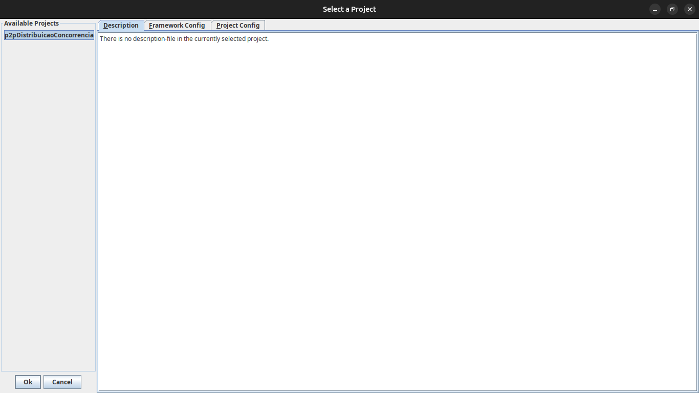
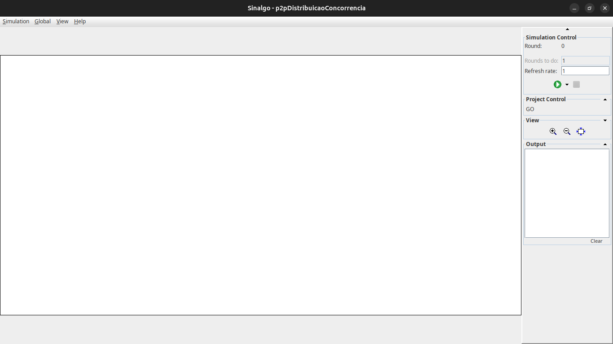
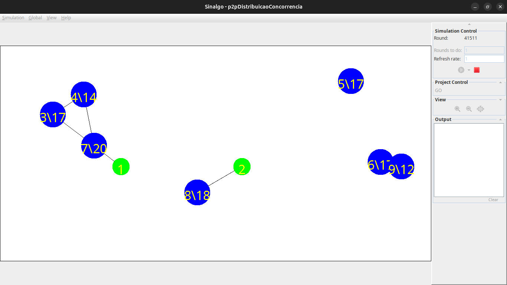

# Sinalgo - Simulator for Network Algorithms

> Antes de clonar, veja que o diretório `sinalgo-maven` é o único que está atualizado e que está recebendo atualizações.
Os outros diretórios são legados de trabalhos anteriores e estão aí apenas por razões sentimentais.

## Compilar
No diretório `sinalgo-maven`:
```bash
mvn clean package
```

## Executar
No diretório `sinalgo-maven`:
```bash
java -jar target/sinalgo-maven-1.0-SNAPSHOT.jar
```

1. Na janela inicial:
    - Selecionar o projeto `p2pDistribuicaoConcorrencia`.
    - Clicar no botão `OK`

    

1. Na segunda janela (espera que ela vai abrir):
    - `View` -> `Zoom To Fit`
    - `Simulate` -> `Generate Nodes`

    

1. Na janela de diálogo `Create new Nodes`:
    - Selecionar 2 nós em `Number of Nodes`
    - Utilizar os nós do tipo `p2pDistribuicaoConcorrencia: MyStationaryNode`
    - Configurar o modelo de mobilidade para `NoMobility` em `Mobility Model`
    - Clicar no botão `OK`

    

1. Selecionar a opção `Simulate` -> `Generate Nodes` para criar os nós móveis. Novamente, na janela de diálogo `Create new Nodes`:
    - Selecionar 7 nós em `Number of Nodes`
    - Utilizar os nós do tipo `p2pDistribuicaoConcorrencia: MyNode`
    - Configurar o modelo de mobilidade para `RandomDirection` ou `RandomWayPoint` em `Mobility Model`
    - Clicar no botão `OK`

    

1. Apertar o botão `Play` verde localizado no painel lateral direito.


    